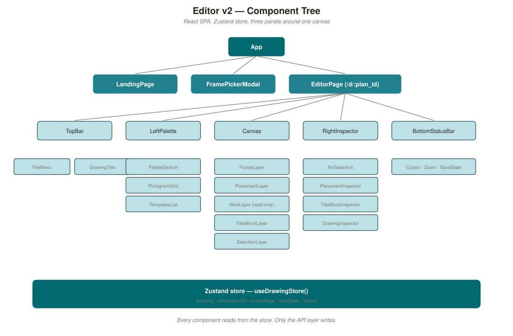

# ES680 Drawing System — Editor v2 Architecture

**Status:** DRAFT v0.1 · 2026-08-10
**Owner:** BM Global
**Purpose:** Design of the rewritten editor. Data model, REST API, component tree, and UI wireframes. **No code yet** — this is the design document we agree on before implementation.

Companion documents:

- [`../spec/drawing-language-spec.md`](../spec/drawing-language-spec.md) — the DrawLang language this editor targets.
- [`../spec/coordinate-system-and-frames.md`](../spec/coordinate-system-and-frames.md) — coordinate system rules.

---

## Table of Contents

1. [Goals and non-goals](#1-goals-and-non-goals)
2. [User journey](#2-user-journey)
3. [High-level architecture](#3-high-level-architecture)
4. [Data model](#4-data-model)
5. [REST API](#5-rest-api)
6. [Frontend component tree](#6-frontend-component-tree)
7. [UI wireframes](#7-ui-wireframes)
8. [State model & undo](#8-state-model--undo)
9. [Persistence formats](#9-persistence-formats)
10. [What we ship in v1 vs. later](#10-what-we-ship-in-v1-vs-later)
11. [Open decisions for you](#11-open-decisions-for-you)

---

## 1. Goals and non-goals

### 1.1 Goals for v1

1. **Frame-first workflow.** User opens the editor, picks a **frame template** (A3 BM Global or A4 plain), and the canvas immediately shows the frame with all its title-block placeholders. No blank white rectangles.
2. **Edit the title-block easily.** Click any field in the title-block (copyright, project name, KKS, revision, date, author, page counter) and edit it inline. Changes persist.
3. **Place pictograms on the drawing area.** Drag from a pictogram palette onto the canvas. Position and rotate.
4. **Round-trip with the ES680 model.** What we save is legal ES680 data — a set of rows in `obj_f`, `obj_g`, `obj_d`, `schr_d` that a real ES680 print pipeline could produce a PDF from.
5. **Export.** Save as `.json` (native), PDF (via PostScript), or SVG (browser preview).

### 1.2 Explicit non-goals for v1

- Not multi-user or collaborative. One editor, one drawing at a time.
- Not connected to a live Ingres DB. We read from `.sag` / `.csn` dumps or our own `.json`.
- No wire routing yet. `ver_b` rows are readable but not editable in v1.
- No `konnektor` cross-page arrows editable in v1.
- No signal cross-reference (`zuli`) editing.
- Only two frames at v1: **A3 (BM Global)** and **A4 (plain)**. Every other frame family (S1, Siemens A0, HMI, marshalling) is out of scope until v1 ships.

### 1.3 Guiding principles

1. **The pen-instruction language is the only source of truth for geometry.** No hardcoded shapes in the editor. If it appears on the canvas, it was rendered from a `cmd` program.
2. **The database schema is the only source of truth for structure.** No shadow object model. Frontend state maps 1:1 onto `obj_f` / `obj_g` / `obj_d` / `schr_d` rows.
3. **Frame pixels are the internal unit.** All positions in the frontend state are frame pixels. Paper size and DPI only enter at render/export time.
4. **Templates are just drawing programs.** The A3 BM Global frame is a `pic_ex` row with `pic_id = -1`. The A4 frame is `pic_id = -2`. They live in the same catalog as everything else.
5. **Every save is atomic.** No half-saved state. Optimistic UI + server confirmation.

---

## 2. User journey

The user story we're designing around:

> *"I want to open the editor, pick the A3 BM Global frame, edit the copyright and project name in the title-block, place a few pictograms in the drawing area, and export a PDF that I could hand to a client."*

Concretely, five steps:

```
1. Open editor          →  Landing screen with "New drawing" and "Open" buttons
2. Pick frame           →  Modal shows A3 (BM Global) and A4 thumbnails
3. Edit title-block     →  Frame appears on canvas. Title-block fields are click-to-edit.
4. Place pictograms     →  Palette on the left. Drag onto canvas. Drop snaps to grid.
5. Export               →  Button opens Export dialog. Choose PDF / SVG / JSON.
```

Every step is one screen. No wizards, no modals stacked on modals.

---

## 3. High-level architecture

```
┌──────────────────────────────────────────────────────────────────┐
│                            BROWSER                               │
│                                                                  │
│  ┌────────────────────────────────────────────────────────────┐  │
│  │  React SPA (Vite + Tailwind + shadcn/ui)                   │  │
│  │                                                            │  │
│  │  ┌─────────────┐  ┌──────────────────┐  ┌───────────────┐  │  │
│  │  │  Palette    │  │   Canvas (SVG)   │  │  Inspector    │  │  │
│  │  │  (left)     │  │   Frame + placed │  │  (right)      │  │  │
│  │  │  Pictograms │  │   pictograms +   │  │  Selected     │  │  │
│  │  │  Templates  │  │   title-block    │  │  object props │  │  │
│  │  └─────────────┘  └──────────────────┘  └───────────────┘  │  │
│  │                                                            │  │
│  │  State: Zustand store, mirrors DB row shape                │  │
│  └────────────────────────────────────────────────────────────┘  │
│                             │                                    │
│                             │  fetch()                           │
│                             ▼                                    │
└──────────────────────────────────────────────────────────────────┘
                              │
                              │  HTTP / JSON
                              ▼
┌──────────────────────────────────────────────────────────────────┐
│                        BACKEND (FastAPI)                         │
│                                                                  │
│  ┌────────────────────────────────────────────────────────────┐  │
│  │  Routes                                                    │  │
│  │    /api/frames                — list catalog frames        │  │
│  │    /api/pictograms            — list catalog pictograms    │  │
│  │    /api/drawings              — CRUD drawings              │  │
│  │    /api/drawings/:id/render   — render to SVG / PS / PDF   │  │
│  └────────────────────────────────────────────────────────────┘  │
│                             │                                    │
│                             ▼                                    │
│  ┌────────────────────────────────────────────────────────────┐  │
│  │  drawlang package (existing)                               │  │
│  │    parser.py, interpreter.py, backends/{svg,ps,pdf}.py     │  │
│  └────────────────────────────────────────────────────────────┘  │
│                             │                                    │
│                             ▼                                    │
│  ┌────────────────────────────────────────────────────────────┐  │
│  │  Catalog store: SQLite                                     │  │
│  │    tables: pic_b, pic_ex, pic_d, pic_p,                    │  │
│  │            frame, raster,                                  │  │
│  │            obj_f, obj_g, obj_d, schr_d, ver_b, konnektor   │  │
│  │                                                            │  │
│  │  Seeded from .sag / .csn dumps on first boot.              │  │
│  └────────────────────────────────────────────────────────────┘  │
└──────────────────────────────────────────────────────────────────┘
```



**Key architectural choices:**

- **SQLite, not Ingres.** We don't need a live connection. SQLite with the same table shape gives us fast catalog lookups and easy backup.
- **The drawing area on the canvas is an inline `<svg>` element** rendered by the browser directly from the current state. The backend is only involved for:
  1. Serving the pictogram catalog (once per session, then cached).
  2. Persisting drawings.
  3. Exporting to PostScript / PDF (browser can't do this).
- **The `drawlang` package is unchanged.** Backend calls into it for rendering; the interpreter has no knowledge of the editor.
- **No WebSocket.** Autosave every 5 s via HTTP `PUT`. Optimistic local update, server confirms.

---

## 4. Data model

### 4.1 Frontend state shape

Zustand store, mirroring `obj_f` / `obj_g` / `obj_d` / `schr_d` row shapes:

```ts
type Drawing = {
  // obj_f row
  plan_id: number;
  nam: string;                    // KKS
  uas: string;                    // unit / plant
  frm_id: number;                 // which frame
  max_se: number;                 // page count
  autor: string;
  datum: string;                  // ISO date
  bez: string;                    // description
  // ...

  // obj_g rows: placed pictograms
  placements: Placement[];

  // obj_d rows: text payloads
  payloads: Payload[];

  // schr_d rows: title-block variable text
  titleBlockFields: TitleBlockField[];

  // ver_b rows: wires (read-only in v1)
  wires: Wire[];
};

type Placement = {
  plan_id: number;
  loc_id: number;                 // stable within a drawing
  pic_id: number;                 // which pictogram from catalog
  gid: number;                    // group id
  po_x: number;                   // frame pixels
  po_y: number;                   // frame pixels
  se: number;                     // which page
  rot: number;                    // degrees (0, 90, 180, 270)
  ebene: number;                  // layer
};

type Payload = {
  plan_id: number;
  loc_id: number;                 // links to a placement
  lau: number;                    // running index
  pic_id: number;
  l_par: number;                  // which parameter
  se: number;
  inhalt: string;                 // the text shown
};

type TitleBlockField = {
  plan_id: number;
  loc_id: number;                 // stable within the frame template
  field_num: number;              // which field of the title-block
  text: string;
};
```

### 4.2 Server-side SQLite schema

Identical column names to ES680, so cross-referencing the notes is one-to-one. `PRIMARY KEY` where the DAMO says so, `INTEGER` for `i2`/`i4`, `TEXT` for `vch*`. See [`../notes/03-user-project-tables.md`](../notes/03-user-project-tables.md) for the full column list.

---

## 5. REST API

Only 9 endpoints. All JSON, all versioned under `/api/v1/`.

### 5.1 Catalog endpoints (read-only)

```
GET  /api/v1/frames
     → [ { frm_id, name, paper, thumbnail_url }, ... ]

GET  /api/v1/frames/:frm_id
     → { frm_id, gu_x, gu_y, go_x, go_y, pa_x, pa_y, pe_x, pe_y,
         ln_x, ln_y, raster_id,
         program: "<pic_ex.cmd string for pic_id = -frm_id>",
         title_block_fields: [
           { loc_id, field_num, label, default_text, x, y, w, h, editable }
         ]
       }

GET  /api/v1/pictograms
     → [ { pic_id, name, class_id, thumbnail_url }, ... ]

GET  /api/v1/pictograms/:pic_id
     → { pic_id, name, class_id, cmd, sc, msk_id,
         parameters: [ { param_nr, port_nr, beatyp, default_text }, ... ]
       }
```

### 5.2 Drawing endpoints (read + write)

```
GET  /api/v1/drawings
     → [ { plan_id, nam, bez, updated_at }, ... ]

POST /api/v1/drawings
     Body: { frm_id, nam, bez }
     → { plan_id, ... full Drawing object with title-block seeded from frame ... }

GET  /api/v1/drawings/:plan_id
     → full Drawing object (obj_f + obj_g + obj_d + schr_d + ver_b)

PUT  /api/v1/drawings/:plan_id
     Body: full Drawing object
     → { plan_id, updated_at }
     (Idempotent. Server replaces all rows for this plan_id atomically.)

DELETE /api/v1/drawings/:plan_id
     → 204
```

### 5.3 Render / export endpoint

```
POST /api/v1/drawings/:plan_id/render
     Body: { format: "svg" | "postscript" | "pdf", paper: "A3" | "A4", page?: 1 }
     → format=svg:        Content-Type: image/svg+xml
       format=postscript: Content-Type: application/postscript
       format=pdf:        Content-Type: application/pdf
```

### 5.4 Error contract

All errors return:

```json
{
  "error_kind": "ValidationError" | "NotFound" | "InterpreterError" | "InternalError",
  "message": "<human-readable>",
  "detail": { ... optional structured context ... }
}
```

with HTTP status 400 / 404 / 422 / 500 respectively.

### 5.5 What we do NOT expose in v1

- No raw catalog CRUD. Frames and pictograms are read-only in v1.
- No user management. Single-user, local-only.
- No history endpoint. Autosave overwrites the current version.
- No websocket, no server-sent events.

---

## 6. Frontend component tree

```
<App>
├── <Router>
│   ├── <LandingPage>          Route: /
│   │   ├── <RecentDrawings>
│   │   └── <NewDrawingButton>
│   │
│   ├── <FramePickerModal>     Route: /new
│   │   └── <FrameCard>×N       Grid of A3 and A4 thumbnails
│   │
│   └── <EditorPage>           Route: /d/:plan_id
│       ├── <TopBar>
│       │   ├── <FileMenu>       New / Open / Save / Export
│       │   ├── <DrawingTitle>   Editable inline
│       │   └── <PageSwitcher>   1 / 2 / 3 of max_se
│       │
│       ├── <LeftPalette>
│       │   ├── <PaletteSearch>
│       │   ├── <PictogramGrid>  Draggable tiles
│       │   └── <TemplatesList>
│       │
│       ├── <Canvas>             (main area)
│       │   ├── <FrameLayer>     Renders pic_ex[-frm_id]
│       │   ├── <PlacementLayer> Renders each obj_g via drawlang
│       │   ├── <WireLayer>      Renders ver_b (read-only in v1)
│       │   ├── <TitleBlockLayer> schr_d fields, click-to-edit
│       │   └── <SelectionLayer> Drag handles, rotation gizmo
│       │
│       ├── <RightInspector>
│       │   ├── <NoSelection>          When nothing selected
│       │   ├── <PlacementInspector>   pic_id, po_x, po_y, rot, se, layer
│       │   ├── <TitleBlockInspector>  field_num, label, text
│       │   └── <DrawingInspector>     obj_f-level: KKS, project, page count
│       │
│       └── <BottomStatusBar>
│           ├── <Cursor>          "x=347, y=812 (frame px)"
│           ├── <Zoom>            "150%"
│           └── <SaveState>       "Saved" / "Saving…" / "Error"
```

State store is a single Zustand `useDrawingStore()` hook. Every component reads from it; only the API layer writes.

---

## 7. UI wireframes

Text wireframes now; SVG wireframes generated below in `docs/diagrams/`.


### 7.1 Landing page

```
┌────────────────────────────────────────────────────────────┐
│  BM Global · Drawing Editor                       [Help]    │
├────────────────────────────────────────────────────────────┤
│                                                            │
│   ┌────────────────────┐   Recent drawings                 │
│   │                    │   ────────────────                │
│   │   + New drawing    │   • 10MAY10FT004 — 2 days ago     │
│   │                    │   • 10MAL22AA013 — 2 days ago     │
│   └────────────────────┘   • 00CPD04.CA    — 3 days ago    │
│                            • (open all…)                   │
│                                                            │
└────────────────────────────────────────────────────────────┘
```

### 7.2 Frame picker

```
┌────────────────────────────────────────────────────────────┐
│  Pick a frame                                     [Cancel]  │
├────────────────────────────────────────────────────────────┤
│                                                            │
│   ┌──────────────────┐        ┌──────────────────┐         │
│   │ ┌──────────────┐ │        │ ┌──────────────┐ │         │
│   │ │              │ │        │ │              │ │         │
│   │ │   A3 preview │ │        │ │  A4 preview  │ │         │
│   │ │              │ │        │ │              │ │         │
│   │ └──────────────┘ │        │ └──────────────┘ │         │
│   │ A3 · BM Global   │        │ A4 · Plain       │         │
│   │ [ Use this ]     │        │ [ Use this ]     │         │
│   └──────────────────┘        └──────────────────┘         │
│                                                            │
└────────────────────────────────────────────────────────────┘
```

### 7.3 Editor — main screen

```
┌──────────────────────────────────────────────────────────────────────────┐
│ File ▾  10MAY10FT004 — AP VAP S/CLTMNTO       Page 1/2 ◀ ▶    [Export]   │
├──────────┬───────────────────────────────────────────────────┬───────────┤
│          │                                                   │           │
│ PALETTE  │             CANVAS (A3 landscape)                 │ INSPECTOR │
│          │                                                   │           │
│ [search] │  ┌─────────────────────────────────────────────┐  │ Selected: │
│          │  │┌───────────────────────────────────────────┐│  │  none     │
│ ▸ AI     │  ││                                           ││  │           │
│ ▸ AO     │  ││          drawing area                     ││  │  (drag a  │
│ ▸ DI     │  ││                                           ││  │  pictogram│
│ ▸ DO     │  ││                                           ││  │  from the │
│ ▸ Logic  │  ││                                           ││  │  palette) │
│ ▸ Valve  │  ││                                           ││  │           │
│ ▸ Text   │  │└───────────────────────────────────────────┘│  │           │
│          │  │┌───title block (click any field to edit)───┐│  │           │
│ [   ▓ ]  │  ││  PROJECT: [Sagunto U10           ]        ││  │           │
│ [   ▓ ]  │  ││  KKS:     [10MAY10FT004          ]        ││  │           │
│ [   ▓ ]  │  ││  DATE:    [2026-08-10]  REV: [R0]         ││  │           │
│ [   ▓ ]  │  ││  © BM Global 2026                Page 1/2 ││  │           │
│          │  │└───────────────────────────────────────────┘│  │           │
│          │  └─────────────────────────────────────────────┘  │           │
│          │                                                   │           │
├──────────┴───────────────────────────────────────────────────┴───────────┤
│ x=347, y=812 (frame px)     Zoom 150%              Saved a moment ago    │
└──────────────────────────────────────────────────────────────────────────┘
```

### 7.4 Editor — pictogram selected

```
┌──────────────────────────────────────────────────────────────────────────┐
│ File ▾  10MAY10FT004                             Page 1/2      [Export]  │
├──────────┬───────────────────────────────────────────────────┬───────────┤
│          │                                                   │           │
│ PALETTE  │                CANVAS                             │ INSPECTOR │
│          │                                                   │           │
│          │       ┌─────────┐                                 │ Pictogram │
│          │       │         │◀───── selected (drag to move,   │  pic_id   │
│          │       │  BLOCK  │       rotate handle on top)     │   1234    │
│          │       │         │                                 │  name:    │
│          │       └─────────┘                                 │  AI_STD   │
│          │                                                   │           │
│          │                                                   │  po_x  347│
│          │                                                   │  po_y  812│
│          │                                                   │  rot     0│
│          │                                                   │  page    1│
│          │                                                   │  layer   0│
│          │                                                   │           │
│          │                                                   │  Params:  │
│          │                                                   │  1 [FT004]│
│          │                                                   │  2 [BAR  ]│
│          │                                                   │           │
│          │                                                   │  [Delete] │
├──────────┴───────────────────────────────────────────────────┴───────────┤
│ 1 selected                                    Saved a moment ago         │
└──────────────────────────────────────────────────────────────────────────┘
```

### 7.5 Editor — title-block field selected

The right inspector switches to show `field_num`, the label, and the text — big text box for easy editing.

### 7.6 Export dialog

```
┌────────────────────────────────────────────┐
│  Export drawing                    [Close] │
├────────────────────────────────────────────┤
│                                            │
│  Format:                                   │
│    ( ) PDF          (recommended)          │
│    ( ) PostScript                          │
│    ( ) SVG          (preview only)         │
│    ( ) JSON         (native format)        │
│                                            │
│  Paper size (PDF / PostScript only):       │
│    (•) A3    ( ) A4                        │
│                                            │
│  Pages:                                    │
│    (•) Current page  ( ) All pages         │
│                                            │
│                        [Cancel] [Export]   │
└────────────────────────────────────────────┘
```

---

## 8. State model & undo

### 8.1 State

One Zustand store, `useDrawingStore()`, exposing:

```ts
{
  drawing: Drawing | null;
  selectedLocId: number | null;
  currentPage: number;
  saveState: "idle" | "dirty" | "saving" | "saved" | "error";
  history: HistoryStack;
}
```

### 8.2 Actions

```ts
loadDrawing(plan_id)
createDrawing(frm_id, nam, bez)
select(loc_id | null)
movePlacement(loc_id, dx, dy)
rotatePlacement(loc_id, degrees)
addPlacement(pic_id, po_x, po_y)
deletePlacement(loc_id)
updatePayload(loc_id, lau, inhalt)
updateTitleBlockField(loc_id, text)
setCurrentPage(se)
undo()
redo()
save()          // debounced 500 ms after last action, or on demand
```

### 8.3 Undo

Command-pattern history stack. Each action is stored as `(inverse, forward)`. `Ctrl-Z` pops one, `Ctrl-Shift-Z` re-applies.

Stack size cap: 200 actions. Beyond that, oldest actions are dropped. State is snapshotted every 50 actions to keep replay bounded.

### 8.4 Autosave

Every action sets `saveState = "dirty"` and schedules a debounced `save()` after 5 s of quiet. Manual `Ctrl-S` triggers immediate save.

---

## 9. Persistence formats

### 9.1 Native (JSON)

Each drawing is one JSON file matching the `Drawing` type in §4.1. Extension: `.es680.json`. Hand-editable.

### 9.2 ES680 round-trip (`.sag`)

A "Save as ES680 dump" export writes the drawing as a set of TAB-separated `.sag` files (one per table) using the length-prefix Ingres varchar encoding documented in [`../notes/03-user-project-tables.md`](../notes/03-user-project-tables.md). A real ES680 install can `loaddb` these back into Ingres.

Not in v1. Documented here so the data model choices don't paint us into a corner.

### 9.3 PostScript / PDF

Rendered on demand by the backend via the existing `drawlang` package + `ps2pdf`. Not stored.

### 9.4 SVG

Rendered by the browser directly from state. Not stored. Copy-out-of-DOM works for anyone who wants a quick preview file.

---

## 10. What we ship in v1 vs. later

### 10.1 v1 (this design)

- Landing + frame picker + editor.
- A3 (BM Global) + A4 (plain) frames.
- Palette with all pictograms from the loaded catalog.
- Placement: drag / move / rotate / delete.
- Title-block editing.
- Text payload editing (`obj_d.inhalt`).
- Multi-page drawings (page switcher).
- Autosave + manual save.
- Export: PDF, PostScript, SVG, JSON.

### 10.2 v2 candidates (not designed yet)

- Wire drawing / editing (`ver_b`).
- `konnektor` cross-page arrows.
- Frame authoring (create a new frame by drawing the border and marking title-block fields).
- Signal cross-reference navigation (`zuli` walk).
- Multi-user collaboration.
- Live Ingres connection.
- `.sag` round-trip export.
- Undo history persistence across sessions.
- Diff / merge between two drawings.

---

## 11. Open decisions for you

Nothing gets built until we agree on these.

| # | Decision | Options | Recommendation |
|---|---|---|---|
| 1 | Frontend framework | React (Vite + Tailwind + shadcn/ui) / SolidJS / Svelte | **React** — matches the existing webapp template we already know |
| 2 | Backend framework | Keep FastAPI / switch to Node/Express | **Keep FastAPI** — the `drawlang` package is Python |
| 3 | Storage | SQLite / Postgres / plain JSON files | **SQLite** — no ops overhead, easy backup, matches ES680 shape |
| 4 | Canvas technology | Inline SVG / Canvas 2D / WebGL | **Inline SVG** — pen instructions map directly, DOM inspection helps debugging |
| 5 | Where to run | Local desktop (Tauri) / self-hosted web (Docker on Hetzner) / published to `pplx.app` | **Hetzner Docker** — matches your existing deploy pattern |
| 6 | Auth | None (single-user local) / basic auth / SSO | **None for v1** — single user, then decide |
| 7 | Frame authoring in v1 | Skip / include | **Skip** — hardcode A3 (BM Global) + A4 for v1, author in v2 |
| 8 | Multi-page in v1 | Yes / no | **Yes** — the real plans have 2–3 pages, we already handle `se` throughout |
| 9 | Whether to render on the server or the client | Server always / client for preview + server for export | **Client for preview, server for export** — described in §3 |

---

## 12. What happens after you approve this

If you sign off on this design, here's the implementation order I'd propose:

1. **Backend skeleton.** FastAPI + SQLite + seed script that loads the two frames and a small pictogram subset from Sagunto's catalog.
2. **API contract.** Wire up the 9 endpoints in §5 with real data. Test with `curl`.
3. **Frontend skeleton.** Vite + React + Tailwind. Landing page + frame picker.
4. **Canvas milestone 1.** Render a frame with its title-block, read-only, at the correct scale on A3.
5. **Canvas milestone 2.** Click a title-block field, edit text, save.
6. **Canvas milestone 3.** Drag a pictogram from the palette, drop on the canvas, save.
7. **Canvas milestone 4.** Select / move / rotate / delete a placement.
8. **Export milestone.** PDF + PostScript + SVG + JSON.
9. **Polish.** Undo/redo, keyboard shortcuts, page switcher, autosave indicator.
10. **Deploy.** Docker + Caddy on Hetzner (reuse [`../deploy/bootstrap.md`](../deploy/bootstrap.md)).

Estimated timeline is deliberately not in this doc — depends on which questions in §11 you overturn.

---

*End of editor v2 architecture. Nothing gets built until §11 is agreed.*
